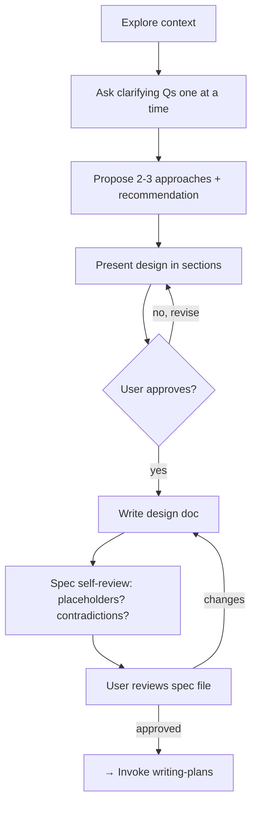

# Brainstorming — Ideas Into Designs

> **Gate rule:** Do NOT write any code, scaffold any project, or invoke any implementation skill until the user has approved a design spec. This applies to EVERY project regardless of perceived simplicity.

## Process Overview

## Steps

### 1. Explore Context
- Check project files, docs, recent commits
- Assess scope: if the request describes multiple independent subsystems, flag it for decomposition first

### 2. Ask Clarifying Questions — One at a Time
- Purpose: what are you really trying to solve?
- Constraints: timeline, platform, performance, budget
- Success criteria: what does "done" look like?
- Prefer multiple-choice questions when possible

### 3. Research Existing Solutions
**BEFORE proposing approaches, search online for reference implementations:**
- Search GitHub, npm, PyPI, package registries for existing solutions
- Check if a well-known library/framework already solves this
- Summarize what you found and report back to the user
- Let the user choose between existing solutions vs custom implementation
- Only self-decide and propose approaches when NO references exist

### 5. Propose 2-3 Approaches
- Lead with your recommended option and explain why
- Cover trade-offs: complexity, performance, maintainability
- Listen for user reaction and adjust

### 6. Present Design in Sections
- Scale each section to its complexity (a few sentences or up to 300 words)
- Cover: architecture, components, data flow, error handling, testing
- Ask after each section: "Does this look right so far?"

### 7. Write the Spec Document
- Save to `<project>/docs/specs/YYYY-MM-DD-<topic>-design.md` (e.g. `/opt/data/projects/<name>/docs/specs/`)
- Be explicit — avoid "TBD" or vague language

### 8. Spec Self-Review
Check for:
- **Placeholders:** Any "TODO", "TBD", or incomplete sections?
- **Contradictions:** Do sections agree with each other?
- **Ambiguity:** Could any requirement be read two ways?
- **Scope:** Focused enough for a single implementation plan?

### 9. User Reviews → Handoff
Ask the user to review the spec file. Wait for approval before proceeding.

Once approved → **invoke `writing-plans`** skill to create the implementation plan. Do NOT jump to implementation directly.

## Key Principles

- **One question per message** — don't overwhelm
- **YAGNI ruthlessly** — remove unnecessary features
- **Prefer smaller units** — each unit should have one clear purpose and a well-defined interface
- **Evidence over claims** — verify assumptions before committing
- **"Too simple to need this" is the anti-pattern** — simple projects are where unexamined assumptions cause the most waste

## When NOT to Use

- Bug fixes where the bug is already clearly understood (use `systematic-debugging`)
- Trivial config changes or single-line edits
- User explicitly says "no design needed, just do it"
