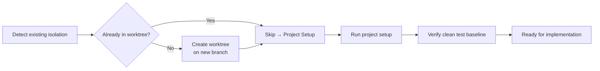

# Git Worktrees — Isolated Development Workspace

## Why This Exists

Feature work on your main branch is risky: partial changes break tests, stash conflicts interrupt flow, and you can't easily context-switch between tasks. Git worktrees give you **a separate working directory** on its own branch — your main checkout stays clean, and you can open multiple terminal sessions in parallel workspaces.

## How It Works



## Steps

### 0. Detect Existing Isolation

```bash
# Check if already in a worktree
GIT_DIR=$(git rev-parse --git-dir 2>/dev/null)
GIT_COMMON=$(git rev-parse --git-common-dir 2>/dev/null)

# Check if in a submodule (not a worktree)
SUPERPROJECT=$(git rev-parse --show-superproject-working-tree 2>/dev/null)
```

| Condition | Meaning |
|-----------|---------|
| `$GIT_DIR != $GIT_COMMON` AND no superproject | ✅ Already in a linked worktree — skip creation |
| In a submodule | Treat as normal repo |
| `$GIT_DIR == $GIT_COMMON` | In main checkout — proceed to create worktree |

### 1. Ask User (if not already decided)

> "Would you like me to set up an isolated worktree on a new branch? It keeps your current branch clean."

If they decline, work in place.

### 2. Create the Worktree

```bash
# Pick location (priority order):
# 1. Existing .worktrees/ or worktrees/ dir in project root
# 2. Default to .worktrees/

LOCATION=".worktrees"  # or existing dir
BRANCH="feat/<feature-name>"

# Verify directory is gitignored before creating
git check-ignore -q "$LOCATION" 2>/dev/null || {
  echo "Warning: $LOCATION not in .gitignore — adding it"
  echo "$LOCATION/" >> .gitignore && git add .gitignore && git commit -m "chore: ignore worktree dir"
}

# Create worktree on new branch
git worktree add "$LOCATION/$BRANCH" -b "$BRANCH"

# Switch into it
cd "$LOCATION/$BRANCH"
```

### 3. Project Setup

Auto-detect and run the appropriate setup:

| Project has | Command |
|-------------|---------|
| `package.json` | `npm install` or `bun install` |
| `pyproject.toml` | `uv sync` or `pip install -e .` |
| `Cargo.toml` | `cargo fetch` |
| `go.mod` | `go mod download` |
| `Gemfile` | `bundle install` |

### 4. Verify Clean Test Baseline

```bash
# Use project-appropriate command
npm test || cargo test || pytest || go test ./...
```

- **If tests pass:** ✅ Ready. Report: `Worktree ready at <path> on branch <name>. Tests: <N> passed.`
- **If tests fail:** Report failures. Ask whether to fix before proceeding or proceed anyway.

### 5. Report

```
🌿 Worktree ready: /path/to/.worktrees/feat/my-feature
🌿 Branch: feat/my-feature
🧪 Tests: 142 passed, 0 failed
Ready to implement.
```

## Cleanup After Completion

When the feature branch is merged or discarded:

```bash
# From the main checkout:
git worktree remove ".worktrees/$BRANCH"
git branch -d "$BRANCH" 2>/dev/null  # if merged
```

## Quick Reference

| Situation | Action |
|-----------|--------|
| Already in a linked worktree | Skip creation |
| User declines isolation | Work in place |
| `.worktrees/` exists | Use it |
| Directory not gitignored | Add to .gitignore first |
| `git worktree add` fails | Report and work in place |
| Tests fail at baseline | Report and ask |
| No project files found | Skip setup step |

## Common Mistakes

- ❌ Creating a worktree when you're already in one (Step 0 prevents this)
- ❌ Forgetting to gitignore the worktree directory (commits `.git/` objects to the repo!)
- ❌ Running setup in the main checkout instead of the new worktree
- ❌ Proceeding with failing tests and blaming your new code for pre-existing failures
